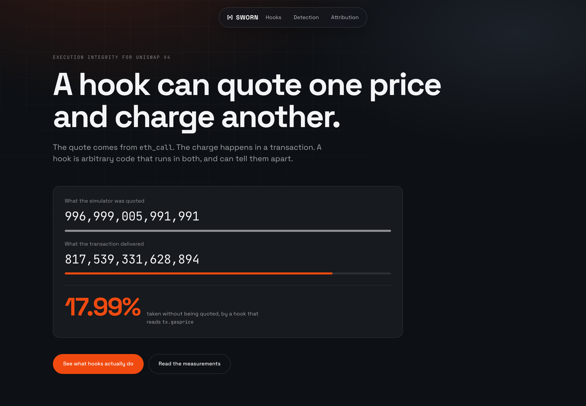
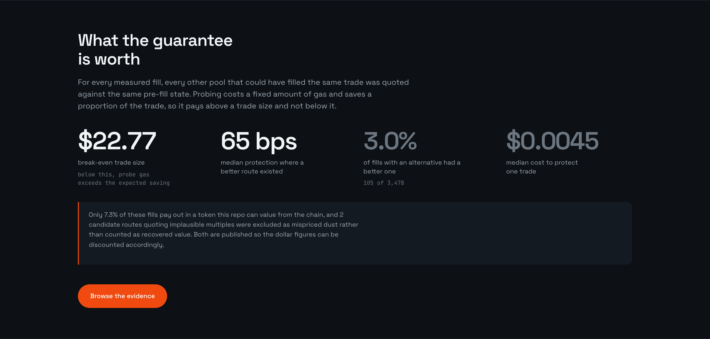
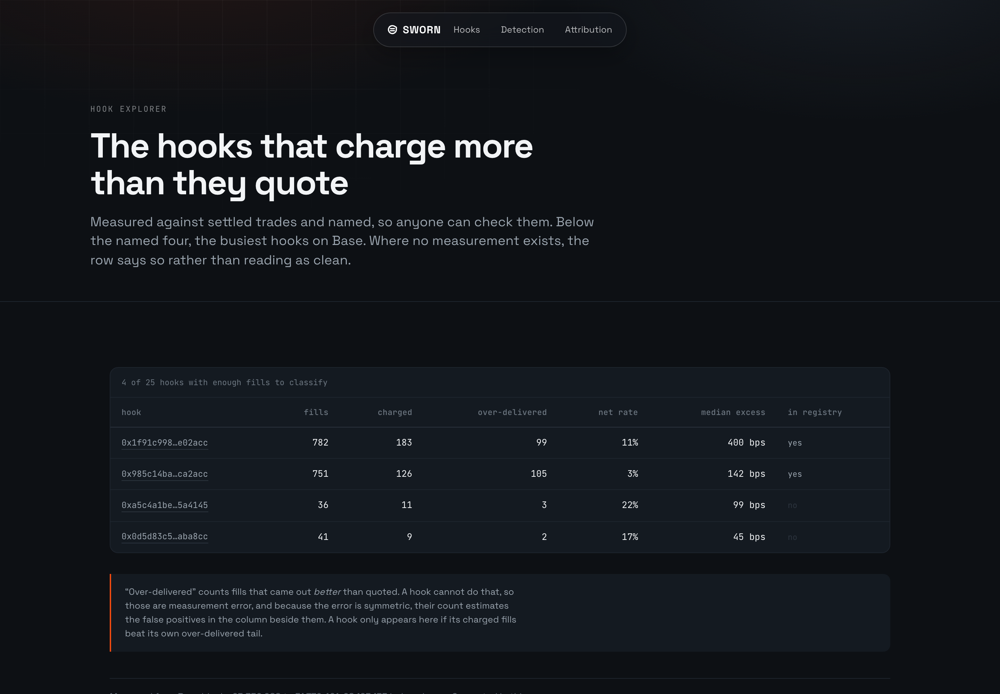

<!--
  Generated file: edit README.template.md, then `make readme`.
  Every number resolves from data/results/*.json; typing a digit here fails CI.
  Tables marked {{table:...}} are generated from the same files.
-->

[](https://aman035.github.io/sworn/)

**[Live dashboard](https://aman035.github.io/sworn/)**

---

**On 14 September 2026, 0x published
[*"Uniswap v4 hooks were a mistake"*](https://0x.org/post/uniswap-v4-hooks-were-a-mistake).**
They analysed 84,163 hooks across six chains and reported **54.2% malicious, 19.4% safe**, with some hooks delivering *"as much as 50% less at execution than the amount quoted"*.

They named one. [`0x800cef53…`](https://basescan.org/address/0x800cef53c3fd41109dffec62e5251bdd7acba5c7)
on Base, an ETH/NVDAc pool: a median fee of 18% when it charged, and
**$143,037** taken. That pool is still live: this repo forks Base at it in
`NamedHooks.fork.t.sol`.

**Hayden Adams [replied](https://x.com/haydenzadams/status/2099711270115013085):**
*"Skill issue, don't route to bad hooks"*, and pointed integrators at the Uniswap API,
which *"avoids malicious hooks"*.

He is right. *Don't route to bad hooks* is exactly the correct advice, and this repo is
an attempt to make it executable, because the question it leaves open is the one an
integrator actually faces: **how do you know which ones are bad, at the moment you
route?**

Three questions, answered with tooling anyone can run.

## 1. Does the public registry tell you?

No. [`0x1f91c998…`](https://basescan.org/address/0x1f91c998e7c2f4b690d75bdbf6502bdcd6e02acc) is **in Uniswap's hooklist with verified source**, and takes a median 400 bps above its stated fee on 11% of its fills, worst observed take 44%.

To be precise about what that does and does not mean: the hooklist
[says plainly](https://github.com/Uniswap/hooklist) that being in it **does not** get a
hook allowlisted for Uniswap's routing. It is a registry, not the routing allowlist, and
this repo cannot see inside the latter. What it shows is that the public, verified,
machine-readable record of a hook carries **no signal at all** about what the hook does to
a swapper. Every field in it is identity: deployer, source verification, permission bits.
None is behaviour.

That is the gap, and it is fixable. A proposal with these fields filled in for every hook
measured here is in [HOOKLIST_PROPOSAL.md](docs/HOOKLIST_PROPOSAL.md).

Routing is a separate question, and there the evidence is direct:
**200,677**
fills through a single UniversalRouter deployment
([`0x6ff5693b…`](https://basescan.org/address/0x6ff5693b99212da76ad316178a184ab56d299b43))
went into hooks measured here as charging more than they quote. That contract is used by
the Uniswap interface and by anyone else who calls it, so this is a fact about the router,
not a claim about any one front-end.

## 2. Can anyone measure this from logs?

No, and that is the finding worth the most. `PoolManager` emits `Swap` **before**
`afterSwap`, so the event excludes whatever the hook takes there. Every indexer,
dashboard and hook-scoring tool built on `Swap` events under-reports exactly the hooks
that take the most. This repo did it that way first, and spent a day chasing the
resulting offset before reading the emission order.

Measured properly, from the traced call rather than the event, with the measurement's
own error subtracted. **4 of 25** hooks with enough fills to classify are
charging more than they quote.

## 3. Can it be closed at execution time?

Yes, and not by detecting anything: static, differential and trace analysis all scored
**zero recall** against ground truth here. `SwornRouter` moves the quote **inside the
transaction that settles it**. Probe every candidate for real, revert, take the best,
and assert that what executed equals what was probed. A hook that lies makes those two
disagree, and the trade does not happen.

# The problem

## What a hook is allowed to do

A v4 hook runs inside `PoolManager.swap`. In `beforeSwap` it can reduce the amount being
swapped or override the fee; in `afterSwap` it can take a further delta out of the result.
Both hook calls receive the same arguments whether the caller is a simulator or a
transaction, but the *environment* differs, and the hook can read it:

- `tx.gasprice` is `0` under `eth_call` and non-zero in a transaction
- `tx.origin` is commonly the zero address in a simulator
- `block.coinbase` and `block.basefee` are frequently zeroed too

A hook that branches on any of them is honest to every quoting engine that exists and
dishonest to the person paying. **The cost to build one is a modifier.** No privileged
position, no capital, no race to win: the hook is already inside every swap that touches
its pool.


## Uniswap's own surfaces point the wrong way

This is not a hypothetical the docs warn about. Three things found while building this,
all with reproductions in the feedback write-up:

1. The [`Swap` event natspec](https://github.com/Uniswap/v4-core/blob/main/src/interfaces/IPoolManager.sol)
   documents `amount0` as *"the delta of the currency0 balance of the pool"*. The code
   emits the **swapper's** delta: the opposite sign. Every indexer built from the docs is
   inverted.
2. The **"Access msg.sender"** guide teaches hooks to read the caller, without noting that
   routers therefore cannot trust a quote.
3. The Trading API defaults to **hooks-inclusive** routing, and the public record of a
   hook describes *identity*, never *behaviour*.

## Measured on mainnet

Every v4 pool on four chains, indexed from `Initialize` logs. No subgraph, no third-party
index.


Then a **uniform random sample of 10,000 Base fills**, each re-quoted against the
state immediately before it and compared with what the swapper actually received:

- **5,121** fills measured, across **1,404** hooks
- **25** of those hooks had enough fills to classify at all
- **4 charge more than they quote**

### The hooks, named

| Hook (Base) | Fills | Charged | Over-delivered | Net rate | Median excess | Score |
| ----------- | ----: | ------: | -------------: | -------: | ------------: | ----: |
| [`0x1f91c998…e02acc`](https://basescan.org/address/0x1f91c998e7c2f4b690d75bdbf6502bdcd6e02acc) ✓ registry | 782 | 183 | 99 | 11% | 400 bps | 24 |
| [`0x985c14ba…ca2acc`](https://basescan.org/address/0x985c14baa2a18316ffda0aefb3a632fadfca2acc) ✓ registry | 751 | 126 | 105 | 3% | 142 bps | 14 |
| [`0xa5c4a1be…5a4145`](https://basescan.org/address/0xa5c4a1be2d59af03c8578609f2621c91ad5a4145) | 36 | 11 | 3 | 22% | 99 bps | 21 |
| [`0x0d5d83c5…aba8cc`](https://basescan.org/address/0x0d5d83c5a1d27654d12670bb07461971a5aba8cc) | 41 | 9 | 2 | 17% | 45 bps | 14 |

`✓ registry` means the hook is in Uniswap's public hooklist with verified source, which
says nothing about how it behaves.
**The worst offender is one of them**: [`0x1f91c998…`](https://basescan.org/address/0x1f91c998e7c2f4b690d75bdbf6502bdcd6e02acc)
is listed, source-verified, and takes a median **400 bps above its stated
fee** on 11% of its fills, with a worst observed take of
44%. A registry keyed on address cannot express that.

Every figure resolves from [`divergence.json`](data/results/divergence.json), which carries
the sha256 of the snapshot it was computed from.

### Half the signal is noise, and that is published too

A hook cannot deliver **more** than it quoted, so any fill measured as over-delivering is a
known false positive, and because the error is symmetric, its count estimates the false
positives among the charged fills:

- **732** charged fills
- **354** over-delivered. Impossible from hook behaviour, so pure error
- **48.4%** estimated false-positive share
- **20** eligible hooks failed the floor and were dropped

Counting positives alone reports a much larger number. Subtracting each hook's own negative
tail leaves 4, and the published figure is the smaller one.

## Why nobody has noticed

The `Swap` event omits the `afterSwap` take, as above. The two numbers, for a hook taking
exactly one percent:

| `amount1`             |                                          value |
| --------------------- | ---------------------------------------------: |
| `Swap` event          |                    `3,941,355,102,139,778,949` |
| `swap()` return value |                    `3,901,941,551,118,381,160` |
| difference            | `39,413,551,021,397,789`. Exactly one percent |

A second, independent defect: the event's sign pattern cannot distinguish exact-input on
token0 from exact-output on token1. They are identical, and **449** of the sampled fills
turned out to be exact-output swaps the event had disguised.

So every fill here is confirmed against its own transaction trace. `amountSpecified`,
`hookData` and the realized output all come from the traced `PoolManager.swap` call. Of
10,000 sampled fills, 8,968 survived confirmation.

## Detection does not catch it either

Four ways to flag a spoofing hook, each scored against what hooks actually did to settled
trades:

| Method | What it looks at | Found | Missed | False alarms | Recall |
| ------ | ---------------- | ----: | -----: | -----------: | -----: |
| `static` | bytecode contains an environment opcode | 0 | 2 | 3 | 0.00 |
| `dynamic` | quotes disagree under permuted `eth_call` | 0 | 2 | 0 | 0.00 |
| `trace` | an environment opcode *executes* while pricing | 0 | 2 | 0 | 0.00 |
| `union` | any of the above | 0 | 2 | 3 | 0.00 |
| `settled_trade` | re-quoting real fills against real prior state | 2 | 0 | 0 | 1.00 |


**No static, differential or trace detector caught either divergent hook** among those both
probed and measured. Only re-quoting settled trades did, and that is retrospective by
construction: it works after someone has already been paid less than they were quoted.

The ground truth is small: it is the overlap between the hooks this repo probed and the
hooks it measured from settled trades, and `Found` plus `Missed` is the whole of it. Too
small to claim a detection *rate*, which is why the counts sit in the table instead of
hiding behind a ratio. What it does show is that every check an integrator could run
before a trade found none of the hooks that were demonstrably charging, while the bytecode
scan raised alarms on hooks that were not.

A score tells you what a hook did last week. It cannot tell you what it is doing to your
transaction right now.

## Who is routing into this

Attribution covers every fill and publishes its own blind spot.

| Product | Router | Fills | Into hooked pools |
| ------- | ------ | ----: | ----------------: |
| Uniswap | [`0x6ff5693b…299b43`](https://basescan.org/address/0x6ff5693b99212da76ad316178a184ab56d299b43) | 3,220,269 | 30.9% |
| Uniswap | [`0xfdf682f5…27fbc7`](https://basescan.org/address/0xfdf682f51fe81aa4898f0ae2163d8a55c127fbc7) | 1,602,197 | 44.7% |
| unlabeled | [`0x8f10b468…13f996`](https://basescan.org/address/0x8f10b468b06c6fd214b65f87778827f7d113f996) | 892,068 | 60.9% |
| unknown-aggregator | [`0x5cdc0f0f…e438e1`](https://basescan.org/address/0x5cdc0f0fa28e0bb05893a4558c988e2bdce438e1) | 471,867 | 7.4% |
| 0x | [`0x7747f8d2…7f2359`](https://basescan.org/address/0x7747f8d2a76bd6345cc29622a946a929647f2359) | 458,339 | 45.3% |
| unlabeled | [`0x11111605…76ca11`](https://basescan.org/address/0x111116053f09d34a7eae8102887004445176ca11) | 408,744 | 0.3% |

**50.2% of fills are unattributed**, reported rather than dropped, because a table
that hides its coverage is not evidence. The products above are not doing anything wrong: they are doing the normal thing, which is to trust a quote.

---

# The solution

Every router today asks a hook a question off-chain, then acts on the answer on-chain.
Those are two different calls, and a hook can answer them differently.

**Sworn asks once.** The quote and the trade become the same call.

`contracts/src/SwornRouter.sol`, verbatim:

```solidity
// 4. The assertion the whole design rests on.
if (execIn != amountsIn[chosen] || execOut != amountsOut[chosen]) {
    revert Divergence(chosen, probed, executed);
}
```

Both sides are checked, so a hook cannot take more input either. That is the entire
product. Everything else exists to make those four lines meaningful.


## Why a hook cannot tell it is being probed

For a hook to cheat Sworn it would have to answer the probe honestly and the execution
dishonestly. To do that it has to tell them apart. Here is everything it could try, and
why each fails:

| It could look at | But |
| ---------------- | --- |
| `tx.gasprice`, `tx.origin`, `block.*` | The probe runs in the same transaction, so every one of these is identical |
| `msg.sender`, call depth, calldata shape | Probe and execution go through the same external self-call, [`runRoute`](contracts/src/SwornRouter.sol#L201). The `probing` flag is read only *after* the last externally observable call |
| `gasleft()` | Both get the same stipend, enforced by [`_assertStipend`](contracts/src/SwornRouter.sol#L251) against EIP-150's `63/64` rule |
| A counter in storage | The probe reverts, so its own bookkeeping rolls back with it |
| A counter in *transient* storage | EIP-1153 slots do not survive the revert either. Tested in `test_gasSniff_probeStateIsRolledBack` |
| Refusing to be probed | A reverting candidate is skipped and the swap still settles through another |

There is no remaining signal. A hook that wants to overcharge you has to overcharge the
probe by the same amount, at which point Sworn routes around it and the hook earns
nothing.

This is not an argument, it is a test suite: twelve attacker capabilities from
`THREAT_MODEL.md`, each with a working fixture in
[`ToxicHooks.sol`](contracts/test/fixtures/ToxicHooks.sol) that tries the attack and
fails.

## What it looks like when it works

Same pool, same block, same swap. The only difference is the router:

```
a hook that charges only when tx.gasprice > 0

  quoted to a simulator          996,999,005,991,991
  naive router, trusting it      817,539,331,628,894   -17.99%
  sworn router, probing in-tx    996,999,005,991,991        0%
```

Produced live by `DemoTest`, not typed in. Run `./scripts/demo.sh` to watch it happen.

## Caught on mainnet

Everything above this line is measurement. This is the router working, against a hook that
is live on Base right now.

Fork Base at block 51,247,545 and send one identical swap twice, from two different
callers, into the pool behind hook
[`0xf54473f4…`](https://basescan.org/address/0xf54473f4c554baa8411c0a7dac7df735f34d00c4):

- caller A, a naive router, receives **17,582,769** USDC units. Fee `0`, nothing taken afterwards.
- caller B, `SwornRouter`, receives **16,340,546**. Fee `700`, and the hook transfers itself a further slice inside `afterSwap`.
- caller B is charged **707 bps** more for the same trade.

Neither caller is known to the hook. Both were deployed seconds earlier in the same test.

Sworn does not need to know why it is being charged. It probes, sees what it is actually
being offered, probes the hookless pool beside it, and settles there instead:
**17,438,404** units, **672 bps** recovered.

```bash
forge test --match-path 'test/fork/ProtectedSwap.fork.t.sol' -vv
```

**The part worth sitting with:** the offline pipeline in this repo did *not* flag that hook
as divergent. It saw a handful of charged fills against nearly as many over-delivered ones
and correctly refused to call that a signal. A full re-quote of 10,000 fills, with a
noise floor and a sensitivity sweep, missed a hook that a single in-transaction probe
caught immediately.

That is the argument, and it tells against this repo's own measurement as much as anyone
else's. A score is retrospective and lossy. The probe is neither.

## Also verified against live hooks

One catch could be a fluke. These pin real deployed code at real blocks and assert the
rest of the claim:

| Fork test | What it settles |
| --------- | --------------- |
| [`RealSwap.fork.t.sol`](contracts/test/fork/RealSwap.fork.t.sol) | A swap through a live Base hook **completes**, pays out, and passes the divergence check. The guarantee is not a well-defended way of refusing to trade |
| [`NamedHooks.fork.t.sol`](contracts/test/fork/NamedHooks.fork.t.sol) | The ETH/NVDAc hook 0x named is live at the pinned block, and Sworn picks between real candidates around it |
| [`BnbNamedHook.fork.t.sol`](contracts/test/fork/BnbNamedHook.fork.t.sol) | The second hook 0x named, on BNB Smart Chain, is live with permission bits `0x0880`. It can override the fee and nothing else: no returns-delta at all |

That last row is the one to take away if you are building a scanner. The obvious heuristic,
*flag the hooks that can return a delta*, scores that hook clean.

These need an archive RPC and skip rather than fail without one, so plain `forge test`
stays runnable offline. `make test-fork` runs the set.

## What the guarantee costs



Probing costs a **fixed** amount of gas and saves a **proportion** of the trade, so it pays
above a trade size and not below it:

- break-even trade size: **$22.77**
- median protection where a better route existed: **65.16 bps**
- median cost to protect one trade: **$0.0045**
- 105 of 3,478 fills with an alternative had a better one

A router should not probe a two-dollar swap, and `maxProbes` and `hookMarginBps` exist so an
integrator can set that line. Gross dollars across the priceable subset were
$1.22 protected against $20.28 of gas: a real sum and a
misleading one, since a uniform sample of Base fills is mostly dust and
92% of that gas came from ten transactions.

Measured probe overhead, verbatim from `forge test --match-contract SwornGasTest`:

```
  baseline (NaiveRouter, 1 pool, no probe)   111,553
  swornSwap, 1 candidate                     204,270   overhead vs naive  +92,717
  swornSwap, 2 candidates                    275,159   overhead vs naive +163,606
  swornSwap, 3 candidates                    341,845   overhead vs naive +230,292
```

## HookBook, and what it refuses to say

[`HookBook`](contracts/src/HookBook.sol) is an on-chain registry of hook scores written by a
scheduled attestor. Its load-bearing property is how it handles **absence**:

- an unscored hook returns `hasScore() == false` and `FLAG_INSUFFICIENT_DATA`
  ([`flags`](contracts/src/HookBook.sol#L124)), **never a clean zero**
- a hook with too few measured fills gets `score = null`; a good rating has to be earned
- updates are monotonic in `asOfBlock` ([`StaleUpdate`](contracts/src/HookBook.sol#L83)),
  which is replay and staleness protection in one
- scores are EIP-712 signed ([`setScoreWithSig`](contracts/src/HookBook.sol#L198)), so
  anyone can relay an attestation and pay for it

| Network      | `HookBook`                                                                                                                                  | Status                                    |
| ------------ | ------------------------------------------------------------------------------------------------------------------------------------------- | ----------------------------------------- |
| Base Sepolia | [`0x8A4470f7DDa8525b484527b21B19c3bc876A04c3`](https://sepolia.basescan.org/address/0x8A4470f7DDa8525b484527b21B19c3bc876A04c3) | Live, attestor authorised, scores written |
| Base mainnet | not deployed | `1,643,224` gas to do so |

The attestor wrote 25 scores; a second scheduled run correctly wrote nothing,
because the registry already held that block. Scoring is fully specified, with a worked example the test suite reproduces exactly.

---

# Demo

```bash
./scripts/demo.sh
```

Three acts, ordered by how hard each is to fake. No manual steps, and every figure is
produced by the EVM during the run: the gate greps the source to prove no `console.log`
string contains a number.

| Act | What runs                                                     | What it shows                                                                    |
| --- | ------------------------------------------------------------- | -------------------------------------------------------------------------------- |
| `1` | `DemoTest` on a local chain                                    | A hook quotes well at `tx.gasprice = 0`, delivers 17.99% less at a real gas price, and Sworn recovers 21.95% by routing around it |
| `2` | `RealSwap.fork.t.sol` on anvil forked from Base                | The same router completes ETH → USDC through **live mainnet hooks** |
| `3` | `app/` static export                                           | The dashboard, rendered from the same result files as this README |

Storyboard, including what the demo deliberately does **not** show, in
[DEMO.md](docs/DEMO.md).

[](https://aman035.github.io/sworn/hooks/)

Three pages behind the landing, all rendered from the same `data/results/*.json` this
README is:
[Hooks](https://aman035.github.io/sworn/hooks/) ·
[Detection](https://aman035.github.io/sworn/detection/) ·
[Attribution](https://aman035.github.io/sworn/attribution/)

---

# Components

| | | |
| --- | --- | --- |
| **`contracts/src`** | Solidity | [`SwornRouter`](contracts/src/SwornRouter.sol), the probe-and-assert router. [`HookBook`](contracts/src/HookBook.sol), the on-chain score registry. |
| **`contracts/test`** | Solidity | Unit, fuzz and invariant tests, twelve toxic-hook fixtures, and fork tests against live Base hooks. |
| **`analysis/lib`** | Python | RPC with adaptive log fetching, parquet compaction, re-quoting, trace recovery, scoring, on-chain pricing. |
| **`analysis/pipelines`** | Python | `census` → `fills` → `divergence` → `intermittency` → `attribution` → `replay` → `precision` → `scores`. Each writes one file to `data/results`. |
| **`app`** | Next.js | The [dashboard](https://aman035.github.io/sworn/). Static export, reads the committed result files at build time. |
| **`attestor`** | TypeScript | Scheduled job that signs scores and writes them to `HookBook`. |
| **`sdk`** | TypeScript | `buildSwornCall`: turns a quote into router calldata. viem action included. |
| **`scripts/gates`** | bash | One gate per phase. `make phase-N` is the only thing that can mark a phase done. |

## Run it locally

You need Node `20`, Python `3.11+`, and Foundry. Nothing else, and no RPC key for the parts
that matter most.

```bash
git clone https://github.com/Aman035/sworn && cd sworn
corepack enable            # the repo is a pnpm workspace; Node ships corepack
make install               # pnpm, git submodules, a venv, and the analysis package
```

**The dashboard**, entirely from committed data, no network:

```bash
cd app && npm run dev          # http://localhost:3100
```

**The tests**, including the twelve attacker fixtures:

```bash
make test                      # forge + pytest + vitest
forge test --root contracts --match-contract ToxicHooksTest -vv
```

**The demo**, three acts, nothing manual:

```bash
./scripts/demo.sh
```

The last two acts fork Base, so they need an archive RPC. Copy `.env.sample` to `.env` and set
`BASE_RPC_ARCHIVE`. Keys stay in that file, which is gitignored and never read into a log
or an error message.

**Re-derive the measurements** (hours, and an archive node with `debug_traceTransaction`):

```bash
make phase-3                   # the gate that produced divergence.json
make phase-6                   # fork tests against live Base hooks, then replay
make readme                    # re-render this file and its diagrams from data/results
```

## Where to check the claims

The mechanism is four places in one file.
[`swornSwap`](contracts/src/SwornRouter.sol#L121) opens the v4 lock,
[`runRoute`](contracts/src/SwornRouter.sol#L201) is the single entry point probe and
execution share, [`ProbeMustRevert`](contracts/src/SwornRouter.sol#L228) enforces that a
probe cannot complete, and [`Divergence`](contracts/src/SwornRouter.sol#L178) is the
assertion above. Probe isolation is the transient slot at
[`UNLOCKED_SLOT`](contracts/src/SwornRouter.sol#L77), and
[`HookBook.flags`](contracts/src/HookBook.sol#L124) is where an unmeasured hook reads as
`INSUFFICIENT_DATA` rather than zero. The measurement side starts at
[`analysis/lib/swapcalls.py`](analysis/lib/swapcalls.py).

Every result file carries `meta.snapshots[]` with a sha256 of its input snapshot and the
commit of the script that produced it. A number that cannot be traced to a snapshot is a
number this repo will not print, enforced by
[`verify_readme_numbers.py`](scripts/verify_readme_numbers.py), which fails the build on
any digit in this file that did not come from a result.

---

# Threat model and limits

- **The divergence sample is small.** 25 hooks clear `min_fills`, out of
  69,242 on Base. It establishes that the measurement works and that
  divergent hooks exist; it is not a population rate.
- **The precision table rests on two positives.** Directionally clear, statistically thin.
- **Accurate measurement needs an archive node with `debug_traceTransaction`.** That is a
  property of v4, not of this repo.
- **Candidate routes are quoted with empty `hookData`**, because no router called them.
- **`HookBook` scores are advisory.** The guarantee is the probe.
- **A hook that is honest to everyone is still honest under Sworn.** This defends against
  quote/execution divergence, not against a hook that charges a large fee openly.

---

## Three things that would fix this upstream

1. **Emit the caller's final delta.** A `SwapSettled` event after
   `_accountPoolBalanceDelta`, or an `afterSwap` delta field on the existing one. Without
   it, "how much did this hook charge" is not answerable from logs at all.
2. **Fix the `Swap` natspec.** It documents the pool's delta; the code emits the
   swapper's, which is the opposite sign.
3. **Carry behaviour in the hooklist**, not just identity. Proposal with data in
   [HOOKLIST_PROPOSAL.md](docs/HOOKLIST_PROPOSAL.md).

All three, with reproductions and the rest of the build notes, are in
**[FEEDBACK.md](FEEDBACK.md)**, written for the Uniswap developer feedback form.

If you want to go deeper: [METRICS.md](docs/METRICS.md) defines every term before it is
measured, [THREAT_MODEL.md](docs/THREAT_MODEL.md) has the full attacker model, and
[PHASES.md](PHASES.md) is the gate ledger.
