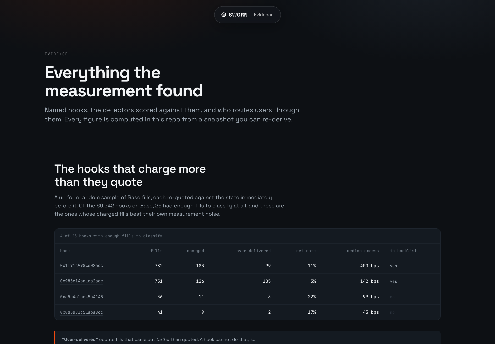

<!--
  Generated file: edit README.template.md, then `make readme`.
  Every number resolves from data/results/*.json; typing a digit here fails CI.
  Tables marked {{table:...}} are generated from the same files.
-->

[](https://aman035.github.io/sworn/)

**Sworn is a Uniswap v4 router that makes the quote and the trade the same transaction.**
It probes every candidate route inside the transaction that settles it, takes the best,
and reverts if what executed differs from what it probed. It is periphery, not a hook:
[`SwornRouter`](contracts/src/SwornRouter.sol) sits where a UniversalRouter sits, and
hooks are what it defends against.

**[Live dashboard](https://aman035.github.io/sworn/)** · [Feedback for
Uniswap](FEEDBACK.md) · [How every number was measured](docs/METRICS.md)

---

## The problem

A v4 hook is arbitrary code running inside `PoolManager.swap`. In `beforeSwap` it can
reduce the amount being swapped or override the fee; in `afterSwap` it can take a further
delta out of the result. Both calls get the same arguments whether the caller is a
simulator or a real transaction, but the **environment** differs, and the hook can read
it:

- `tx.gasprice` is `0` under `eth_call` and non-zero in a transaction
- `tx.origin` is commonly the zero address in a simulator
- `block.coinbase` and `block.basefee` are frequently zeroed too

A hook that branches on any of them is honest to every quoting engine that exists and
dishonest to the person paying. **The cost to build one is a modifier.** No privileged
position, no capital, no race to win: the hook is already inside every swap that touches
its pool.


This is not hypothetical. On 14 September 2026, 0x published
[*"Uniswap v4 hooks were a mistake"*](https://0x.org/post/uniswap-v4-hooks-were-a-mistake):
84,163 hooks analysed across six chains, **54.2% malicious**, some delivering
*"as much as 50% less at execution than the amount quoted"*.

**This repo measured it independently.** Every v4 pool on four chains indexed from
`Initialize` logs, then a uniform random sample of 10,000 Base fills, each re-quoted
against the state immediately before it and compared with what the swapper actually
received:

- **4 of the 25** hooks with enough fills to classify charge more than they quote
- **200,677** swaps reached them through a single UniversalRouter deployment alone
- the worst is **in Uniswap's hooklist with verified source**, taking a median
  400 bps above its stated fee, worst observed take 44%

Named, because a claim that "some hooks charge" is unfalsifiable and a claim about
`0x1f91c998…` is one you can go and check:

| Hook (Base) | Fills | Charged | Over-delivered | Median excess |
| ----------- | ----: | ------: | -------------: | ------------: |
| [`0x1f91c998…e02acc`](https://basescan.org/address/0x1f91c998e7c2f4b690d75bdbf6502bdcd6e02acc) ✓ hooklist | 782 | 183 | 99 | 400 bps |
| [`0x985c14ba…ca2acc`](https://basescan.org/address/0x985c14baa2a18316ffda0aefb3a632fadfca2acc) ✓ hooklist | 751 | 126 | 105 | 142 bps |
| [`0xa5c4a1be…5a4145`](https://basescan.org/address/0xa5c4a1be2d59af03c8578609f2621c91ad5a4145) | 36 | 11 | 3 | 99 bps |
| [`0x0d5d83c5…aba8cc`](https://basescan.org/address/0x0d5d83c5a1d27654d12670bb07461971a5aba8cc) | 41 | 9 | 2 | 45 bps |

`✓ hooklist` means the hook is listed by Uniswap with verified source. **Over-delivered**
counts fills that came out *better* than quoted, which a hook cannot do, so those are
pure measurement error; because the error is symmetric, their count estimates the false
positives sitting in the charged column beside them. Roughly 48.4% of charged fills
in this sample are error, and a hook is only named once its charged fills beat its own
over-delivered tail. That is why the headline is 4 and not a larger number. Every
hook, fill and snapshot hash is on the
[evidence page](https://aman035.github.io/sworn/evidence/).

**And you cannot see any of this in the logs.** `PoolManager` emits `Swap` *before*
`afterSwap`, so the event excludes whatever the hook takes there. Every indexer, dashboard
and hook-scoring tool built on `Swap` events under-reports exactly the hooks that take the
most. That finding, the natspec sign bug beside it, and the rest of the build notes are in
**[FEEDBACK.md](FEEDBACK.md)**.

## The reply

Hayden Adams [replied to that post](https://x.com/haydenzadams/status/2099711270115013085):

> Skill issue, don't route to bad hooks

pointing integrators at the Uniswap API, which *"avoids malicious hooks"*.

**He is right.** *Don't route to bad hooks* is exactly the correct advice. The question it
leaves open is the one an integrator actually faces: **how do you know which ones are bad,
at the moment you route?** Two answers exist today, and neither works.

**The public record does not tell you.** Two lists get confused here, so to be precise:

- **The [hooklist](https://github.com/Uniswap/hooklist)** is Uniswap's public,
  machine-readable file of hooks. Anyone can open a pull request to add theirs. It records
  who deployed it, whether the source is verified, and which permission bits the address
  encodes. It is public, and this repo reads it.
- **The routing allowlist** is a private list *inside* Uniswap's routing API: the hooks
  that API is willing to send a user's trade through. It is not published, and nothing
  here can see it.

Being in the first does not get a hook onto the second, and the hooklist's own README says
so. What the public one shows is that every field in it is **identity**: who deployed it,
is the source verified, what may it do. None is **behaviour**: what does it actually
charge. That is why a listed, source-verified hook can still be the worst offender
measured here. A proposal with behaviour fields filled in for every hook measured is in
[HOOKLIST_PROPOSAL.md](docs/HOOKLIST_PROPOSAL.md).

**Detection does not tell you either.** Static bytecode analysis, differential `eth_call`
and `debug_traceCall` were each scored against what hooks actually did to settled trades.
All three found **none** of the hooks that were demonstrably charging. Only re-quoting
settled trades caught them, and that works after someone has already been paid less than
they were quoted. The full matrix, and the small ground truth it rests on, are on the
[evidence page](https://aman035.github.io/sworn/evidence/).

A score tells you what a hook did last week. It cannot tell you what it is doing to your
transaction right now.

## The solution

Every router today asks a hook a question off-chain, then acts on the answer on-chain.
Those are two different calls, and a hook can answer them differently.

**Sworn asks once.** The quote and the trade become the same call.

`contracts/src/SwornRouter.sol`, verbatim:

```solidity
// 4. The assertion the whole design rests on.
if (execIn != amountsIn[chosen] || execOut != amountsOut[chosen]) {
    revert Divergence(chosen, probed, executed);
}
```

Both sides are checked, so a hook cannot take more input either. That is the entire
product. Everything else exists to make those four lines meaningful.


### Why a hook cannot tell it is being probed

To cheat Sworn a hook would have to answer the probe honestly and the execution
dishonestly, which means telling them apart. Here is everything it could try:

| It could look at | But |
| ---------------- | --- |
| `tx.gasprice`, `tx.origin`, `block.*` | The probe runs in the same transaction, so every one of these is identical |
| `msg.sender`, call depth, calldata shape | Probe and execution go through the same external self-call, [`runRoute`](contracts/src/SwornRouter.sol#L201). The `probing` flag is read only *after* the last externally observable call |
| `gasleft()` | Both get the same stipend, enforced by [`_assertStipend`](contracts/src/SwornRouter.sol#L251) against EIP-150's `63/64` rule |
| A counter in storage | The probe reverts, so its own bookkeeping rolls back with it |
| A counter in *transient* storage | EIP-1153 slots do not survive the revert either |
| Refusing to be probed | A reverting candidate is skipped and the swap still settles through another |

A hook that wants to overcharge you has to overcharge the probe by the same amount, at
which point Sworn routes around it and the hook earns nothing. This is not an argument, it
is a test suite: twelve attacker capabilities from
[THREAT_MODEL.md](docs/THREAT_MODEL.md), each with a working fixture in
[`ToxicHooks.sol`](contracts/test/fixtures/ToxicHooks.sol) that tries the attack and
fails.

### Caught on a live Base hook

Everything above is measurement. This is the router working against a hook that is live on
Base right now. Fork Base at block 51,247,545 and send one identical swap twice, from
two different callers, into the pool behind
[`0xf54473f4…`](https://basescan.org/address/0xf54473f4c554baa8411c0a7dac7df735f34d00c4):

- caller A, a naive router, receives **17,582,769** USDC units. Fee `0`, nothing taken afterwards
- caller B, `SwornRouter`, receives **16,340,546**. Fee `700`, and the hook moves a further slice out inside `afterSwap`
- caller B is charged **707 bps** more for the same trade

Neither caller is known to the hook. Both were deployed seconds earlier in the same test.
Sworn does not need to know *why* it is being charged: it probes, sees what it is actually
being offered, probes the hookless pool beside it, and settles there instead for
**17,438,404** units, recovering **672 bps**.

```bash
forge test --match-path 'test/fork/ProtectedSwap.fork.t.sol' -vv
```

**The part worth sitting with:** the offline pipeline in this repo did *not* flag that
hook. It saw a handful of charged fills against nearly as many over-delivered ones and
correctly refused to call that a signal. A full re-quote of 10,000 fills, with a noise
floor and a sensitivity sweep, missed a hook that a single in-transaction probe caught
immediately. That tells against this repo's own measurement as much as anyone else's.

Three more fork tests pin real deployed code at real blocks:
[`RealSwap`](contracts/test/fork/RealSwap.fork.t.sol) proves a swap through a live hook
**completes** rather than merely refusing to trade,
[`NamedHooks`](contracts/test/fork/NamedHooks.fork.t.sol) runs against the ETH/NVDAc hook
0x named, and [`BnbNamedHook`](contracts/test/fork/BnbNamedHook.fork.t.sol) shows the
second hook 0x named overcharges through the fee override alone, with permission bits
`0x0880` and no returns-delta at all, which is what a scanner keyed on returns-delta would
score clean.

### What it costs

Insurance pricing: the premium is **fixed** and small, the payout **proportional** and
rare. Median cost to protect one trade is **$0.0045**; a better route existed on
3.0% of fills that had an alternative, and when one did it was worth
**65.16 bps** at the median. Break-even trade size is **$22.77**, so a router
should not probe a two-dollar swap, and `maxProbes` and `hookMarginBps` exist so an
integrator can set that line.

The dollar totals do not flatter this and are published anyway: **$1.22** protected
against **$20.28** of gas across the priceable subset. Only 7.3% of fills pay
out in a token this repo can value from the chain, a uniform sample of Base fills is
overwhelmingly dust well under the break-even, and 92% of that gas came from ten
transactions. On average-case Base dust, probing everything loses money. The case for it
is the tail, and the tail is the catch above.

Measured probe overhead, verbatim from `forge test --match-contract SwornGasTest`:

```
  baseline (NaiveRouter, 1 pool, no probe)   111,553
  swornSwap, 1 candidate                     204,270   overhead vs naive  +92,717
  swornSwap, 2 candidates                    275,159   overhead vs naive +163,606
  swornSwap, 3 candidates                    341,845   overhead vs naive +230,292
```

## Components

| | | |
| --- | --- | --- |
| **`contracts/src`** | Solidity | [`SwornRouter`](contracts/src/SwornRouter.sol), the probe-and-assert router. [`HookBook`](contracts/src/HookBook.sol), an on-chain score registry that returns `INSUFFICIENT_DATA` rather than a clean zero for a hook nobody has measured. |
| **`contracts/test`** | Solidity | Unit, fuzz and invariant tests, twelve toxic-hook fixtures, and fork tests against live Base hooks. |
| **`analysis/lib`** | Python | RPC with adaptive log fetching, parquet compaction, re-quoting, trace recovery, scoring, on-chain pricing. |
| **`analysis/pipelines`** | Python | `census` → `fills` → `divergence` → `intermittency` → `attribution` → `replay` → `precision` → `scores`. Each writes one file to `data/results`. |
| **`app`** | Next.js | The [dashboard](https://aman035.github.io/sworn/). Static export, reads the committed result files at build time. |
| **`attestor`** | TypeScript | Scheduled job that signs scores and writes them to `HookBook`, live on Base Sepolia at [`0x8A4470f7…`](https://sepolia.basescan.org/address/0x8A4470f7DDa8525b484527b21B19c3bc876A04c3). |
| **`sdk`** | TypeScript | `buildSwornCall`: turns a quote into router calldata. viem action included. |
| **`scripts/gates`** | bash | One gate per phase. `make phase-N` is the only thing that can mark a phase done. |

### Where to verify the integration

The mechanism is four places in one file.
[`swornSwap`](contracts/src/SwornRouter.sol#L121) opens the v4 lock,
[`runRoute`](contracts/src/SwornRouter.sol#L201) is the single entry point probe and
execution share, [`ProbeMustRevert`](contracts/src/SwornRouter.sol#L228) enforces that a
probe cannot complete, and [`Divergence`](contracts/src/SwornRouter.sol#L178) is the
assertion quoted above. Probe isolation is the transient slot at
[`UNLOCKED_SLOT`](contracts/src/SwornRouter.sol#L77);
[`HookBook.flags`](contracts/src/HookBook.sol#L124) is where an unmeasured hook reads as
`INSUFFICIENT_DATA`; the measurement side starts at
[`analysis/lib/swapcalls.py`](analysis/lib/swapcalls.py).

Every result file carries `meta.snapshots[]` with a sha256 of its input snapshot and the
commit of the script that produced it. A number that cannot be traced to a snapshot is a
number this repo will not print, enforced by
[`verify_readme_numbers.py`](scripts/verify_readme_numbers.py), which fails the build on
any digit in this file that did not come from a result.

## Run it locally

You need Node `20`, Python `3.11+`, and Foundry. No RPC key for the parts that matter
most.

```bash
git clone https://github.com/Aman035/sworn && cd sworn
corepack enable            # the repo is a pnpm workspace; Node ships corepack
make install               # pnpm, git submodules, a venv, and the analysis package
```

```bash
cd app && npm run dev      # the dashboard, from committed data, no network
make test                  # forge + pytest + vitest
make test-fork             # fork tests; needs BASE_RPC_ARCHIVE in .env
make readme                # re-render this file and its diagrams from data/results
```

Copy `.env.sample` to `.env` for the fork tests. Keys stay in that file, which is
gitignored and never read into a log or an error message.

Re-deriving the measurements takes hours and an archive node with
`debug_traceTransaction`: `make phase-3` produces `divergence.json`, `make phase-6` runs
the fork tests and the replay.

## Demo

```bash
./scripts/demo.sh
```

Four acts, ordered by how hard each is to fake. No manual steps, and every figure is
produced by the EVM during the run: the gate greps the source to prove no `console.log`
string contains a number.

| Act | What runs | What it shows |
| --- | --------- | ------------- |
| `1` | `DemoTest` on a local chain | A fixture hook quotes well at `tx.gasprice = 0`, delivers materially less at a real gas price, and Sworn routes around it |
| `2` | `RealSwap.fork.t.sol` on anvil forked from Base | The same router completes ETH → USDC through **live mainnet hooks**, probe and execution agreeing |
| `3` | `ProtectedSwap.fork.t.sol` on the same fork | **The catch.** A real Base hook charges one caller more than another for the identical swap, and Sworn routes away from it |
| `4` | `app/` static export | The dashboard, rendered from the same result files as this README |

Acts `2` and `3` need an archive RPC and are skipped with a warning without one. Act `3`
is the one to watch, and the only act that is neither a fixture nor a happy path.
Storyboard, including what the demo deliberately does **not** show, in
[DEMO.md](docs/DEMO.md).

[](https://aman035.github.io/sworn/evidence/)

---

## Threat model and limits

- **The divergence sample is small.** 25 hooks clear `min_fills`, out of
  69,242 on Base. It establishes that the measurement works and that
  divergent hooks exist; it is not a population rate.
- **The precision table rests on two positives.** Directionally clear, statistically thin.
- **Accurate measurement needs an archive node with `debug_traceTransaction`.** That is a
  property of v4, not of this repo.
- **Candidate routes are quoted with empty `hookData`**, because no router called them.
- **`HookBook` scores are advisory.** The guarantee is the probe.
- **A hook that is honest to everyone is still honest under Sworn.** This defends against
  quote/execution divergence, not against a hook that charges a large fee openly.

### Three things that would fix this upstream

1. **Emit the caller's final delta.** A `SwapSettled` event after
   `_accountPoolBalanceDelta`, or an `afterSwap` delta field on the existing one. Without
   it, "how much did this hook charge" is not answerable from logs at all.
2. **Fix the `Swap` natspec.** It documents the pool's delta; the code emits the
   swapper's, which is the opposite sign.
3. **Carry behaviour in the hooklist**, not just identity. Proposal with data in
   [HOOKLIST_PROPOSAL.md](docs/HOOKLIST_PROPOSAL.md).

All three, with reproductions, are in **[FEEDBACK.md](FEEDBACK.md)**.
[METRICS.md](docs/METRICS.md) defines every term before it is measured, and
[PHASES.md](PHASES.md) is the gate ledger.

MIT licensed.
