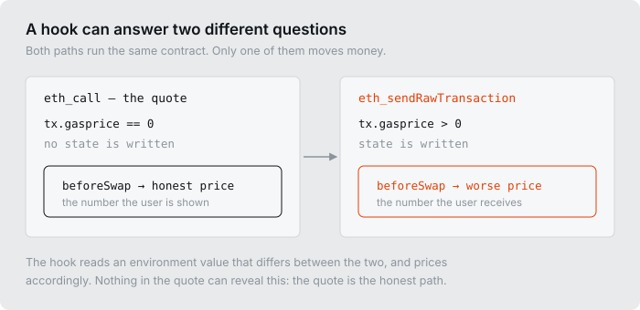
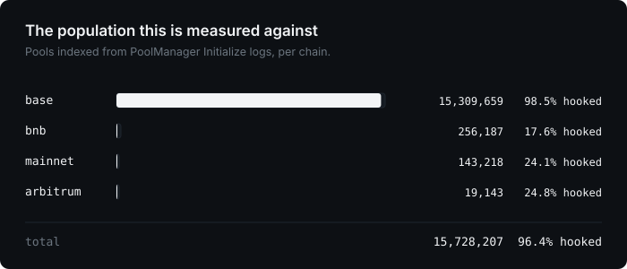
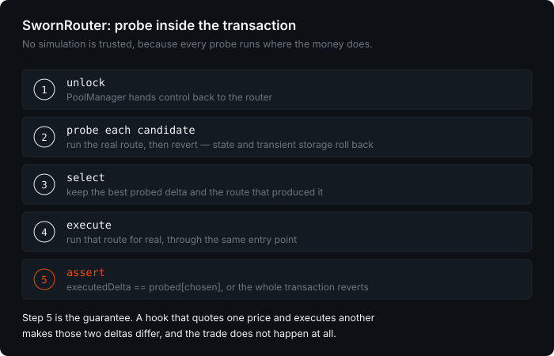
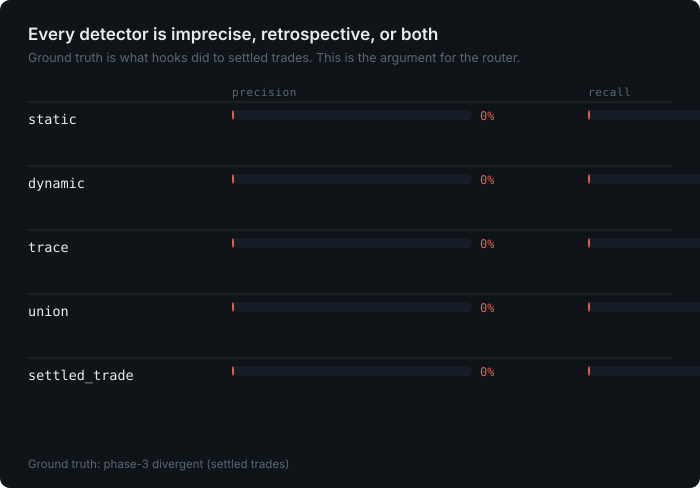
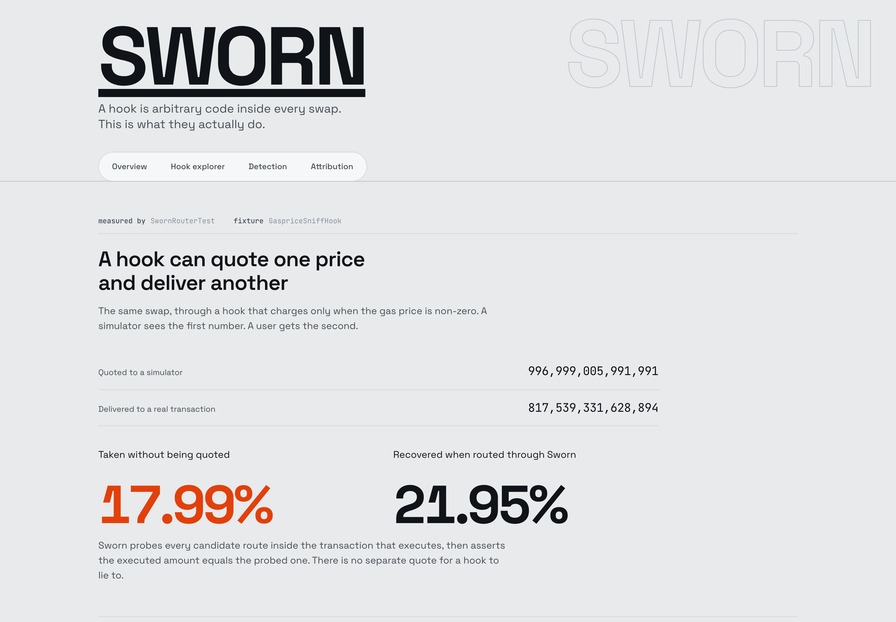

<!--
  Generated file: edit README.template.md, then `make readme`.
  Every number below resolves from data/results/*.json. Typing a digit here fails CI.
  Section order is fixed by SWORN_PLAN.md Phase 10.
-->

# Sworn

**A hook can quote one price to a simulator and charge another to a transaction.** Nothing
in Uniswap v4 prevents it, every router in production is priced off the simulated answer,
and the gap is invisible in the logs. Sworn closes it by moving the quote _inside_ the
transaction that settles: every candidate route is executed for real and reverted, the best
is taken, and the router asserts that what executed equals what it probed. A hook that
lies makes those two disagree, and the trade does not happen.

[](docs/METRICS.md)
[](PHASES.md)
[](FEEDBACK.md)

---

## 1. The property the protocol assumes

Four assumptions hold everything up, and v4 guarantees none of them:

| Assumed                            | Actually                                                         |
| ---------------------------------- | ---------------------------------------------------------------- | -------------------------------------- |
| A quote predicts execution         | A hook runs in both and can tell them apart                      |
| Hook code is reviewable            | {{result:census.json:chains[chain=base].upgradeable              | int}} hooks on Base sit behind a proxy |
| Routers can price safely off-chain | Every router prices with `eth_call`, which is the honest path    |
| Allowlists are enough              | An allowlisted hook can be upgraded the block after it is listed |

The Trading API defaults to hooks-inclusive routing. Allowlisting is the only defence
anyone ships, and it is a defence against _identity_, not against _behaviour_.

## 2. How spoofing works



`tx.gasprice` is zero in `eth_call` and non-zero in a transaction. So are `tx.origin`,
`block.coinbase` and `block.basefee` in most simulators. A hook that branches on any of
them is honest to every quoting engine that exists and dishonest to the person paying.

Each pattern below has a working fixture in this repo and a test that shows Sworn defeating
it — none of them is hypothetical:

| Pattern          | Keys on                                      | Fixture                                                            |
| ---------------- | -------------------------------------------- | ------------------------------------------------------------------ |
| env-sniff        | `tx.gasprice`, `tx.origin`, `block.coinbase` | `GaspriceSniffHook`, `OriginSniffHook`, `CoinbaseBasefeeSniffHook` |
| gas-sniff        | `gasleft()` at entry                         | `GasSniffHook`                                                     |
| dice-roll        | block randomness, or a counter               | `DiceRollBlockHook`, `DiceRollCounterHook`                         |
| owner-switch     | a flag flipped between blocks                | `OwnerSwitchHook`                                                  |
| router-whitelist | `msg.sender`                                 | `RouterWhitelistHook`                                              |
| callback-sniff   | calling back to find a probe flag            | `CallbackSniffHook`                                                |
| revert-grief     | reverting for non-simulations                | `RevertGriefHook`                                                  |

All in [`contracts/test/fixtures/ToxicHooks.sol`](contracts/test/fixtures/ToxicHooks.sol).

## 3. Cost to exploit

One modifier. A hook that reads `tx.gasprice` and picks a fee costs nothing extra to
deploy, needs no privileged position, and requires no capital. There is no mempool race to
win and no liquidity to commit — the hook is already inside every swap that touches its
pool.

That asymmetry is the whole argument. The defence has to be structural, because the attack
is free.

## 4. Measured on mainnet



Every v4 pool on four chains, indexed from `Initialize` logs — no subgraph, no third-party
index. Base alone: {{result:census.json:chains[chain=base].pools_total|int}} pools across
{{result:census.json:chains[chain=base].hooks_total|int}} distinct hooks.

Front-end attribution covers every fill and publishes its own blind spot:
**{{result:attribution.json:unlabeled_share|pct}} of fills are unlabeled.** A table that
hides its coverage is not evidence.

Divergence is measured by re-quoting settled trades against the state immediately before
them, over a uniform random sample of
{{result:divergence.json:trace_confirmation.sampled|int}} Base fills:

|                                     |                                                     |
| ----------------------------------- | --------------------------------------------------: | --------- |
| fills measured                      |               {{result:divergence.json:totals.fills | int}}     |
| hooks seen                          |               {{result:divergence.json:totals.hooks | int}}     |
| hooks with enough fills to classify |      {{result:divergence.json:totals.eligible_hooks | int}}     |
| **divergent hooks**                 | \*\*{{result:divergence.json:totals.divergent_hooks | int}}\*\* |

The denominator that matters is `eligible_hooks`, not `hooks`. A hook seen three times
cannot be called clean or dirty, and this repo will not do either.

**Half of the charged fills are measurement error, and that is published too.** A hook
cannot deliver _more_ than it quoted, so every fill measured as over-delivering is a known
false positive — and because the error is symmetric, its count estimates the false
positives among the charged fills:

|                                               |                                                                     |
| --------------------------------------------- | ------------------------------------------------------------------: | ----- |
| charged fills                                 |                  {{result:divergence.json:noise_floor.charged_fills | int}} |
| over-delivered fills (impossible; pure error) |            {{result:divergence.json:noise_floor.overdelivered_fills | int}} |
| estimated false-positive share                | {{result:divergence.json:noise_floor.estimated_false_positive_share | pct}} |
| eligible hooks that failed the floor          |        {{result:divergence.json:noise_floor.hooks_failing_the_floor | int}} |

Counting positives alone gave a larger and wronger headline. Subtracting a hook's own
negative tail is what the published number does.

Each figure resolves from [`data/results/`](data/results), and every result file carries the
sha256 of the snapshot it was computed from.

## 5. The finding: `Swap` events cannot measure hook take

Worth reading even if you never touch this repo.

`PoolManager` emits `Swap` **between** `beforeSwap` and `afterSwap`, so its amounts exclude
anything the hook takes in `afterSwap` — they are neither the swapper's input nor their
output. Measured on Base, for one hook taking exactly one percent there:

| `amount1`             |                                          value |
| --------------------- | ---------------------------------------------: |
| `Swap` event          |                    `3,941,355,102,139,778,949` |
| `swap()` return value |                    `3,901,941,551,118,381,160` |
| difference            | `39,413,551,021,397,789` — exactly one percent |

Read from the event, that hook appears to hand users an extra percent. It charges them.
**Any analytics built on `Swap` events under-reports exactly the hooks that take the
most** — and building on the event is the obvious approach. This repo did it first, and
spent a day chasing the resulting offset through fee tiers before reading the emission
order.

A second, independent defect: the event's sign pattern cannot distinguish exact-input on
token0 from exact-output on token1. They are identical.

So every measured fill is confirmed against its own transaction trace — `amountSpecified`,
`hookData` and the realized output all come from the traced `PoolManager.swap` call. Of
{{result:divergence.json:trace_confirmation.sampled|int}} sampled fills,
{{result:divergence.json:trace_confirmation.confirmed|int}} survived, and
{{result:divergence.json:trace_confirmation.dropped.exact-output|int}} were exact-output
swaps the event had disguised. Both defects are filed upstream in [FEEDBACK.md](FEEDBACK.md).

## 6. Sworn



`SwornRouter` moves the quote inside the transaction that settles it.

- **Probe and execution share one entry point.**
  [`runRoute(hops, amountSpecified, probing)`](contracts/src/SwornRouter.sol#L201) is the
  same external self-call either way, so a hook observes identical gas and call context.
  `probing` is read only _after_ every externally observable call.
- **A probe reverts, so state rolls back** — including EIP-1153 transient storage. A hook
  cannot leave itself a note saying "that was a probe".
- **The assertion is the product.**
  [`revert Divergence(chosen, probed, executed)`](contracts/src/SwornRouter.sol#L178) fires
  when execution disagrees with the probe. The user does not get a worse fill; the user
  gets no fill.

Because the probe _is_ the real environment, there is nothing for a hook to distinguish. It
cannot charge the probe honestly and the execution dishonestly, because they are the same
call in the same transaction at the same gas price.

**Verified against live mainnet hooks.** `RealSwapForkTest` routes ETH → USDC through real
Base hooks on a fork and asserts the swap completes, that the tokens received equal the
amount the router reported, and that the divergence check held.

### Gas

Verbatim from `forge test --match-contract SwornGasTest`, against a slippage-only router:

```
  baseline (NaiveRouter, 1 pool, no probe)   111,553
  swornSwap, 1 candidate                     204,270   overhead vs naive  +92,717
  swornSwap, 2 candidates                    275,159   overhead vs naive +163,606
  swornSwap, 3 candidates                    341,845   overhead vs naive +230,292
```

Linear after the first, which pays for the probe machinery. On an L2 the guarantee costs a
fraction of a cent. Full working in [docs/GAS.md](docs/GAS.md).

## 7. Sworn replay

`analysis/pipelines/e_replay.py` asks what the router would have been worth: for each
measured fill it quotes every other pool that could have filled the same trade against the
same pre-fill state, and takes the difference when a candidate beat what the user actually
got — net of probe gas, charged at the price that fill actually paid.

Two rules keep the figure honest: protection is measured against the **traced** output, not
the `Swap` event; and an output token that cannot be priced from the chain is **not priced
at all**, with the priceable share published as `price_confidence`.

## 8. HookBook and the attestor

[`HookBook`](contracts/src/HookBook.sol) is an on-chain registry of hook scores, written by
a scheduled attestor. Its load-bearing property is what it does with _absence_:

- an unscored hook returns `hasScore() == false` and `FLAG_INSUFFICIENT_DATA`, **never a
  clean zero**, so "unmeasured" can never be mistaken for "safe";
- a hook with fewer measured fills than `min_fills_for_score` gets `score = null` — a good
  rating has to be earned;
- updates are monotonic in `asOfBlock`, which is replay protection and staleness protection
  in one;
- scores are EIP-712 signed, so anyone can relay an attestation and pay for it.

Scoring is fully specified in [docs/SCORING.md](docs/SCORING.md), including a worked example
that the test suite reproduces exactly.

## 9. Detection precision



Four ways to catch a spoofing hook, scored against what hooks actually did to settled
trades:

- **static** — scan bytecode for environment opcodes. Nearly every hook on Base contains
  one, so this flags nearly every hook. High recall, unusable precision.
- **differential** — quote under permuted `eth_call` environments. Catches hooks keyed on
  environment, misses dice-rollers and anything keyed on state.
- **trace** — `debug_traceCall` with call-stack attribution, so an environment read is
  credited to the hook that made it. Better, and needs an archive node.
- **settled trades** — re-quote real fills against real prior state. Catches everything,
  and only after someone has been hurt.

Every row is imprecise or retrospective. **A score tells you what a hook did last week; the
probe tells you what it is doing to your transaction right now.**

## 10. What Uniswap should change

1. **Emit the caller's final delta.** A `SwapSettled` event after `_accountPoolBalanceDelta`,
   or an `afterSwap` delta field on the existing event. Without it, "how much did this hook
   charge" is not answerable from logs — see [the finding above](#5-the-finding-swap-events-cannot-measure-hook-take) and [FEEDBACK.md](FEEDBACK.md).
2. **Fix the `Swap` natspec.** It documents `amount0` as the pool's delta; the code emits
   the swapper's. Every indexer built from the docs is inverted.
3. **Carry behaviour in the hooklist**, not just identity: `divergenceScore`,
   `envSensitive`, `intermittent`, `upgradeable`. An allowlist keyed on address cannot
   express that a listed hook changed last week.
4. **Point the "Access msg.sender" guide at in-transaction verification.** It currently
   teaches hooks to read the caller without noting that routers therefore cannot trust a
   quote.
5. **Expose per-route hook scores in the Trading API**, so an integrator choosing
   hooks-inclusive routing can see what they are opting into.
6. **Document the required compiler settings.** `optimizer_runs = 800` cannot compile
   `PoolManager` at all, and the error names a Yul internal.

## 11. Threat model and limits

Stated here rather than buried, because the alternative is a headline that outruns its
evidence:

- **The divergence sample is small.** It establishes that the measurement machinery works
  end to end — the re-quote agrees with reality at the median — not how often hooks charge
  across the population.
- **Accurate measurement needs an archive node with `debug_traceTransaction`.** Everything
  above the trace layer is unavailable to anyone working from logs alone. That is a property
  of v4, not of this repo.
- **Candidate routes are quoted with empty `hookData`**, because no router called them and
  there is nothing to recover.
- **`HookBook` scores are advisory.** The guarantee is the probe; a score only hints at
  which candidates are worth probing.
- **A hook that is honest to everyone is still honest under Sworn.** This defends against
  quote/execution divergence, not against a hook that charges a large fee openly.

Full model in [docs/THREAT_MODEL.md](docs/THREAT_MODEL.md).

## 12. The dashboard



Every figure renders from the same `data/results/*.json` the README does, with a provenance
rail showing the snapshot hash and block range behind each panel. Static export, no server.

```bash
cd app && npm install && npm run dev
```

## 13. Reproduce everything

```bash
cp .env.sample .env          # archive RPC per chain; keys never leave the file
make install
make test                    # forge + pytest
make phase-3                 # re-run the gate that produced divergence.json
make phase-6                 # fork tests against live Base hooks, then replay
```

Every result file carries `meta.snapshots[]` with a sha256 of its input snapshot and the
commit of the script that produced it. A number that cannot be traced to a snapshot is a
number this repo will not print — enforced by
[`scripts/verify_readme_numbers.py`](scripts/verify_readme_numbers.py), which fails the
build on any digit in this file that did not come from a result.

| Path                 | What                                                                                     |
| -------------------- | ---------------------------------------------------------------------------------------- |
| `contracts/src`      | [`SwornRouter`](contracts/src/SwornRouter.sol), [`HookBook`](contracts/src/HookBook.sol) |
| `analysis/lib`       | RPC, log fetching, compaction, re-quoting, trace recovery, scoring                       |
| `analysis/pipelines` | census → fills → divergence → intermittency → attribution → scores                       |
| `app`                | Next.js dashboard, static export                                                         |
| `docs`               | `METRICS.md` defines every term _before_ it is measured                                  |
| `scripts/gates`      | one script per phase; `make phase-N` is the only way a phase closes                      |

[METRICS.md](docs/METRICS.md) · [SCORING.md](docs/SCORING.md) · [GAS.md](docs/GAS.md) ·
[THREAT_MODEL.md](docs/THREAT_MODEL.md) · [FEEDBACK.md](FEEDBACK.md) ·
[PHASES.md](PHASES.md) · [SWORN_PLAN.md](SWORN_PLAN.md)
