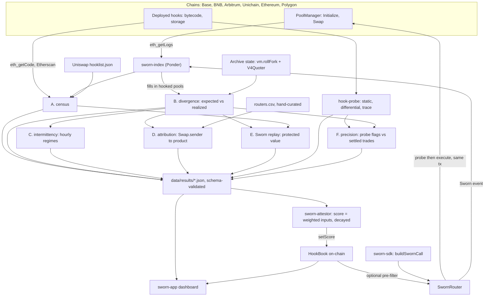

# Architecture

> Skeleton. Phase 1 fills in components, data flow and RPC requirements; Phase 0 only
> records the pinned toolchain and dependencies so builds are reproducible from day one.

## Pinned dependencies

Solidity dependencies are git submodules under `contracts/lib/`. `make install` runs
`git submodule update --init --recursive`.

| Dependency                 | Pin                                          | Why                                                           |
| -------------------------- | -------------------------------------------- | ------------------------------------------------------------- |
| `foundry-rs/forge-std`     | `v1.9.7`                                     | test harness, cheatcodes                                      |
| `Uniswap/v4-core`          | `59d3ecf` (2025-05-13)                       | `PoolManager`, `Hooks`, `PoolKey`, delta accounting           |
| `Uniswap/v4-periphery`     | `9969eec` (no release tags exist)            | `V4Quoter`, `BaseHook`, router base classes                   |
| `Uniswap/permit2`          | `cc56ad0` (only tag is the deployed address) | `permitTransferFrom` path in `SwornRouter`                    |
| `Uniswap/universal-router` | `v1.6.0`. **referenced, not vendored**      | read-only reference for the Phase 11 UR-compatible entrypoint |

`v4-core` transitively pins `solmate` and `openzeppelin-contracts`; both are remapped
through `contracts/lib/v4-core/lib/` so there is exactly one copy of each in the build.

**Why v4-core is not on the `v4.0.0` tag.** It started there, but `v4-periphery` has no
release tags and its `main` is built against a later v4-core in which `SwapParams` and
`ModifyLiquidityParams` moved out of `IPoolManager` into `types/PoolOperation.sol`.
Compiling `V4Quoter`, which Phase 3 needs to re-quote fills. Against `v4.0.0` fails
outright. Keeping both versions is worse than choosing one: the two `IPoolManager` types
would be distinct to the compiler, so a `PoolKey` built from one could not be passed to a
quoter built from the other. The whole repo therefore uses `59d3ecf`, the exact commit
`v4-periphery` pins. This is a source reorganisation, not an ABI change, so it still
describes the `PoolManager` bytecode deployed on every target chain.

## Toolchain

| Tool       | Version              | Notes                                                                  |
| ---------- | -------------------- | ---------------------------------------------------------------------- |
| Foundry    | `forge 1.5.1-stable` | solc `0.8.26`, `evm_version = cancun`, `via_ir = true`, optimizer 800  |
| Node       | `>= 20` (CI: 20)     | pnpm `9.15.3` workspaces                                               |
| TypeScript | `5.7.3`              | strict, `noUncheckedIndexedAccess`, `exactOptionalPropertyTypes`       |
| Python     | `>= 3.11` (CI: 3.11) | pandas / pyarrow / duckdb, pinned exactly in `analysis/pyproject.toml` |

`evm_version = cancun` is required: v4 uses transient storage (`TSTORE`/`TLOAD`) for its
lock and delta accounting, and `SwornRouter`'s unlock guard does the same.

## Chains

Build priority, matching `analysis/config.yaml`:

| Chain    | ID    | Why this order                                         |
| -------- | ----- | ------------------------------------------------------ |
| Base     | 8453  | highest v4 hook activity; the named 0x hook lives here |
| BNB      | 56    | second named 0x hook                                   |
| Arbitrum | 42161 | volume                                                 |
| Unichain | 130   | Uniswap's own chain                                    |
| Ethereum | 1     | L1 reference, worst-case probe gas                     |
| Polygon  | 137   | the Enso report's hook                                 |

## Components

_Phase 1._ Component diagram, data flow (index → analysis → results → attestor →
`HookBook` → SDK/app), and the RPC capability matrix (archive state, `eth_getLogs`
ranges, `debug_traceCall`).

---

## Components

| Component              | Path                            | What it is                                                                                        | Trust it needs                                    |
| ---------------------- | ------------------------------- | ------------------------------------------------------------------------------------------------- | ------------------------------------------------- |
| `sworn-index`          | `index/`                        | Ponder app indexing `Initialize`, `Swap` and `Sworn` events per chain                             | an RPC that serves `eth_getLogs` over long ranges |
| analysis pipelines A–F | `analysis/`                     | Python: census, divergence, intermittency, attribution, replay, precision                         | archive state, `vm.rollFork`, a price source      |
| `hook-probe`           | `probe/`                        | static (bytecode), differential (`eth_call` permutations) and trace (`debug_traceCall`) detection | `debug_traceCall` for the trace method only       |
| `SwornRouter`          | `contracts/src/SwornRouter.sol` | probes candidates inside the real transaction, executes the best, asserts executed == probed      | none: it is the trust anchor                     |
| `HookBook`             | `contracts/src/HookBook.sol`    | on-chain score + flags per hook, with the snapshot hash behind each score                         | the attestor key set                              |
| `sworn-attestor`       | `attestor/`                     | scheduled job: recompute scores, write `HookBook`, publish signed results                         | archive RPCs, an attestor key                     |
| `sworn-sdk`            | `sdk/`                          | builds `SwornRouter` calldata from a quote; viem action, adapters                                 | none                                              |
| `sworn-app`            | `app/`                          | dashboard: hook explorer, attribution, protected value                                            | read-only access to results + index               |

The router is deliberately at the bottom of that table's trust column. Everything else
can be wrong, stale or absent and a user routing through `SwornRouter` still cannot be
served a price different from the one that executes. The data layer makes the problem
_visible_; only the router makes it _impossible_.

## Data flow

Two paths leave that diagram and they are independent on purpose:

- **The measurement path** (`index` → pipelines → `results` → attestor → `HookBook`) is
  advisory. It is only as fresh as its last run and it is allowed to be wrong.
- **The execution path** (`sdk` → `SwornRouter` → `PoolManager`) is self-contained. It
  reads no oracle and trusts no score; `HookBook` enters it only as an _optional_ gas
  optimisation that skips probing hooks already known to be bad.

## RPC requirements

| Capability                                  | Needed by                      | Why                                                                                   |
| ------------------------------------------- | ------------------------------ | ------------------------------------------------------------------------------------- |
| `eth_getLogs` over wide block ranges        | index, census                  | enumerate every pool and fill since the PoolManager deployment block                  |
| Archive state at arbitrary blocks           | pipelines B, E; `vm.rollFork`  | re-quote a fill against the state that existed immediately before it                  |
| `vm.rollFork(txHash)` (Foundry)             | pipeline B (exact method)      | state _after prior transactions in the same block_: the only correct pre-fill state  |
| `debug_traceCall`                           | `hook-probe` trace mode        | prove an env opcode executed on the swap path rather than merely existing in bytecode |
| `eth_call` with `from`/`gasPrice` overrides | `hook-probe` differential mode | the permutation grid that exposes env-sniffing                                        |

Phase 3 at full coverage issues tens of thousands of `rollFork` calls. Mitigations, in
the order they matter: batch by block so one fork serves many fills, reuse fork handles
across a worker's queue, and cache `expected_output` keyed by
`(chain, txHash, logIndex)` so a rerun costs nothing.

## Why `evm_version = cancun` is load-bearing

v4 keeps its lock and its currency deltas in transient storage. `SwornRouter`'s probe
runs inside the same `unlock` as the execution, so its reentrancy guard must live in
transient storage too: a normal storage flag would be a difference a hook could read
between the probe and the execution, which is precisely the thing the design forbids.
